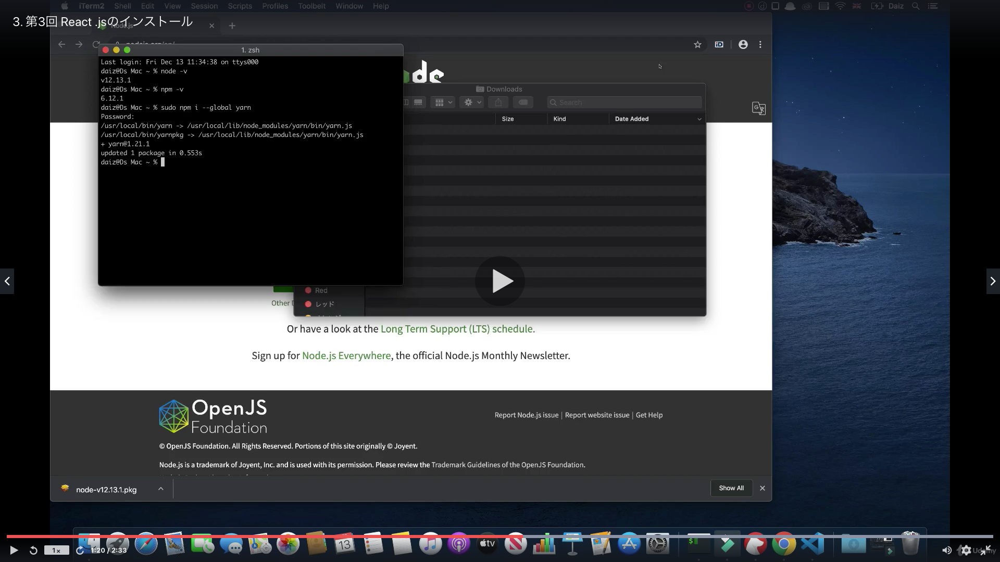
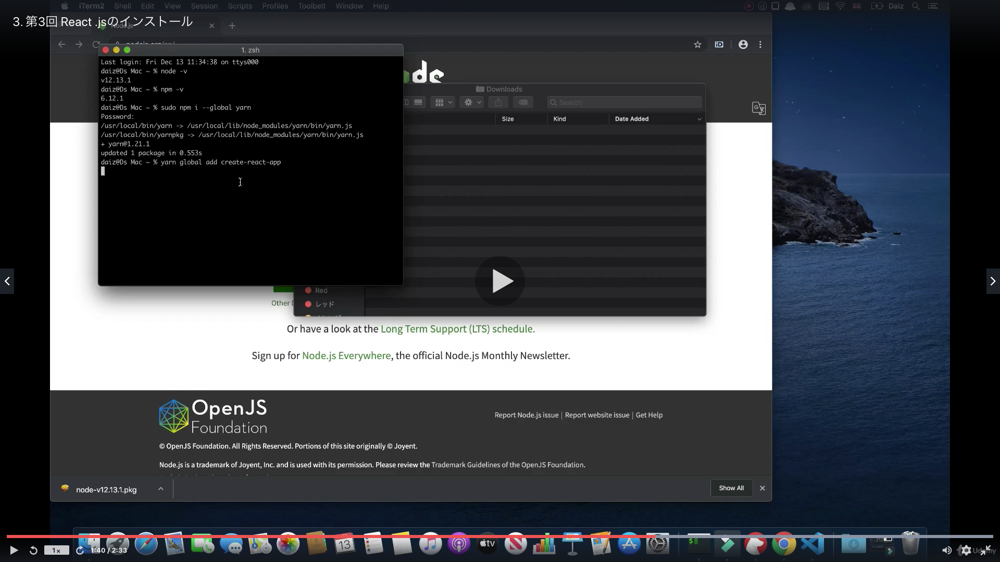
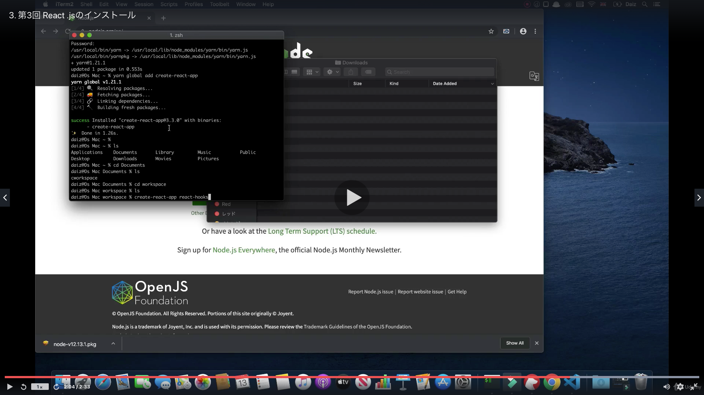

# Section03:環境設定

<a id = "contents">

# Contents
* [Flow](#flow)

### Pickup
* 


<a id = "flow">

## Flow
* 
* 
* 

* commands
  ```
  node -v
  npm -v
  yarn -v
  yarn add create-react-app
  create-react-app react-hooks
  ```

### [Return to Contents](#contents)

