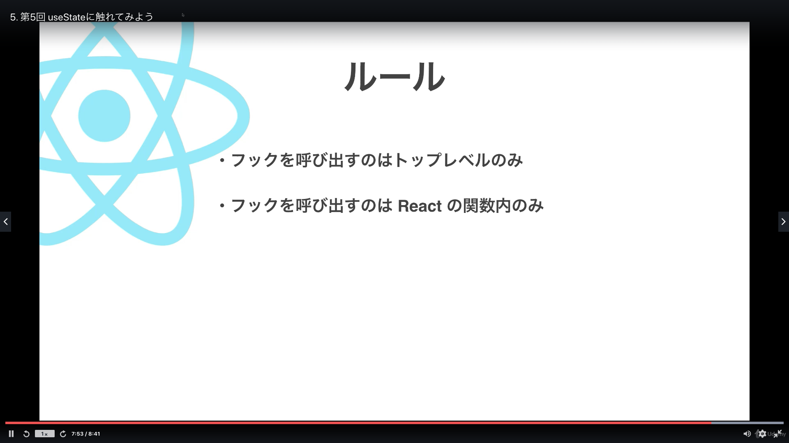

# Section04:useStateに触れてみよう

<a id = "contents">

# Contents
* [Flow](#flow)
* [useState](#useState)

### Pickup
* 


<a id = "flow">

## Flow
* commands
  ```
  npm install expo
  npm install expo-cli
  expo init react-hooks (expo-template-blank)
  ```
  ```
  cd react-hooks
  npm install expo-cli
  expo start
  ```
  * Delete .git file (then you can push folder)
  ```
  ls -a
  rm -rf .git
  ```

### [Return to Contents](#contents)


<a id = "useState">

## useState
* 

### [Return to Contents](#contents)

